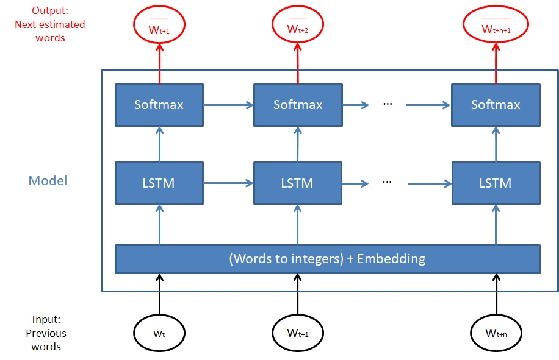

```{r setup, include=FALSE}
knitr::opts_chunk$set(echo = FALSE)
```

## Introduction
<font size="5">

- The project consisted in building a model that predict the following word that a user may write based on the previous words in a sentence.

- To build this model, Data composed of english corpus coming from blogs, newspaper and twitter were provided by [HC Corpora](http://corpora.epizy.com/). Some preprocessing were applied like removing numbers, non latin characters, punctuation, lowering characters ... 

- The next slides present the model and the application developped with shiny

</font>


## The model
<font size="5">

- The choosen model is mainly based on a LSTM (Long Short Term Memory) block which is an artificial recurrent neural network (RNN) architecture allowing to take into account the previous words of a sentence for the prediction of the next one.

- The model is composed of different layers:


    1) Words to Integers + embedding: this layer allow to transform a word into an integer ( word's index in a dictionnary) and then into a dense vector to feed the LSTM block

    2) LSTM block

    3) Softmax: This layer allows to obtain a dense probability vector of size N (size of the dictionnary). The most probable next word corresponds to the one which obtain the highest probability. 

</font>

## The model

{width=95%}

## Shiny application
<font size="5">

- The link of the application: https://jmtx.shinyapps.io/LSTM_shiny/

- In the blue area, the user can write his sentence, then click to the submit button to predict the potential next words

- In the green area, the potential next words and their probabilities are shown.

<font color="red">

- Important: the application loading time only ends when the probability table appears (green) thus please wait 10 to 30 secs before using the application. After each prediction take 1 s.

</font></font>
{width=50%}


</font>